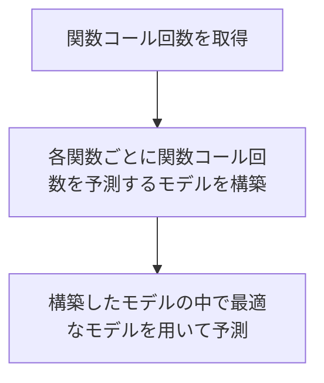
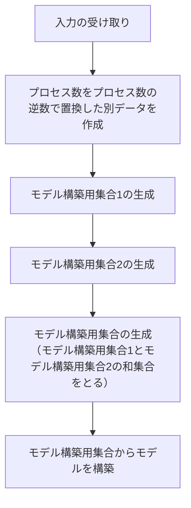

# 研究用リポジトリ

# 環境構築

`docker-compose up -d`

## jupyter lab 開発環境

`vscode` で remote containers を使う。

# テストおよびライブラリノートの.py化の実行

## ブラウザ＆dockerを使用する場合

1. コンテナが動作している状態で`localhost:8080`をブラウザで開く
2. jupyter labでterminalを起動する
3. `/root/src/lib` へ移動
4. `make` を実行

## vscode を使用する場合

1. remote containers を用いて vscode による開発環境を立ち上げる
2. vscode のターミナルにて下記のコマンドを実行 
    1. `cd /workspace/lib`
    2. `make`

# 提案手法のフロー図



# モデル「`Model_LinearSumOfElementCombinations_ForMultipleRegression`」について

## 着想理由

下記のような疑似コードに対応するモデルが存在しなかったため。

```C
...

if (説明変数1 * 説明変数2) > 条件値:
    関数()
    ...
...
```

## モデル構築における各用語について

入力が「プロセス数」,「問題サイズ1」,「問題サイズ2」の3要素の場合で説明する。

### 入力の列名の集合

(プロセス数, 問題サイズ1, 問題サイズ2)

### 入力の列名の集合の「プロセス数」を「プロセス数の逆数」に置換したもの

(1/プロセス数, 問題サイズ1, 問題サイズ2)

### モデル構築用集合1

モデル構築用集合1は下記から構成される

* 3要素の組み合わせの積
    * プロセス数×問題サイズ1×問題サイズ2
* 2要素の組み合わせの積
    * プロセス数×問題サイズ1
    * プロセス数×問題サイズ2
    * 問題サイズ1×問題サイズ2
* 1要素のみ
    * プロセス数
    * 問題サイズ1
    * 問題サイズ2

### モデル構築用集合2

モデル構築用集合2は下記から構成される

* 3要素の組み合わせの積
    * プロセス数の逆数×問題サイズ1×問題サイズ2
* 2要素の組み合わせの積
    * プロセス数の逆数×問題サイズ1
    * プロセス数の逆数×問題サイズ2
    * 問題サイズ1×問題サイズ2
* 1要素のみ
    * プロセス数の逆数
    * 問題サイズ1
    * 問題サイズ2

### モデル構築用集合

モデル構築用集合はモデル構築用集合1とモデル構築用集合2との和集合

* 3要素の組み合わせの積
    * プロセス数×問題サイズ1×問題サイズ2
    * プロセス数の逆数×問題サイズ1×問題サイズ2
* 2要素の組み合わせの積
    * プロセス数×問題サイズ1
    * プロセス数×問題サイズ2
    * プロセス数の逆数×問題サイズ1
    * プロセス数の逆数×問題サイズ2
    * 問題サイズ1×問題サイズ2
* 1要素のみ
    * プロセス数
    * プロセス数の逆数
    * 問題サイズ1
    * 問題サイズ2

### 処理の流れ


