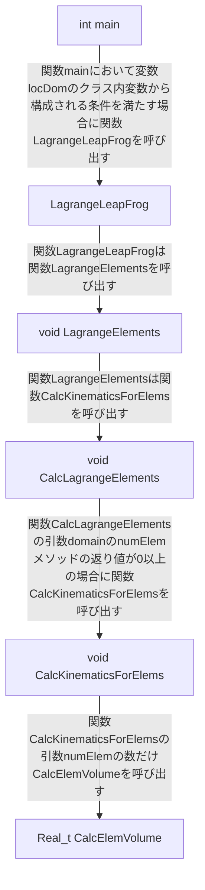

# LULESHで実行される関数についての調査記録

## `Real_t CalcElemVolume()`

引数は3つの配列で、行うことは「与えられた引数の要素から値を算出し、その値を返す」。

コードリーディングおよび実データの観察からも、

$
関数コール回数 = イテレーション数 \times 問題サイズ ^ 3
$

であると考えられる。



### `void CalcKinematicsForElems` --> `Real_t CalcElemVolume`

```Cpp
void CalcKinematicsForElems( Domain &domain,
                             Real_t deltaTime, Index_t numElem )
{

  // loop over all elements
#pragma omp parallel for firstprivate(numElem, deltaTime)
  for( Index_t k=0 ; k<numElem ; ++k )
  {
    Real_t B[3][8] ; /** shape function derivatives */
    Real_t D[6] ;
    Real_t x_local[8] ;
    Real_t y_local[8] ;
    Real_t z_local[8] ;
    Real_t xd_local[8] ;
    Real_t yd_local[8] ;
    Real_t zd_local[8] ;
    Real_t detJ = Real_t(0.0) ;

    Real_t volume ;
    Real_t relativeVolume ;
    const Index_t* const elemToNode = domain.nodelist(k) ;

    // get nodal coordinates from global arrays and copy into local arrays.
    CollectDomainNodesToElemNodes(domain, elemToNode, x_local, y_local, z_local);

    // volume calculations
    volume = CalcElemVolume(x_local, y_local, z_local );
    relativeVolume = volume / domain.volo(k) ;
    domain.vnew(k) = relativeVolume ;
    domain.delv(k) = relativeVolume - domain.v(k) ;

    // set characteristic length
    domain.arealg(k) = CalcElemCharacteristicLength(x_local, y_local, z_local,
                                             volume);

    // get nodal velocities from global array and copy into local arrays.
    for( Index_t lnode=0 ; lnode<8 ; ++lnode )
    {
      Index_t gnode = elemToNode[lnode];
      xd_local[lnode] = domain.xd(gnode);
      yd_local[lnode] = domain.yd(gnode);
      zd_local[lnode] = domain.zd(gnode);
    }

    Real_t dt2 = Real_t(0.5) * deltaTime;
    for ( Index_t j=0 ; j<8 ; ++j )
    {
       x_local[j] -= dt2 * xd_local[j];
       y_local[j] -= dt2 * yd_local[j];
       z_local[j] -= dt2 * zd_local[j];
    }

    CalcElemShapeFunctionDerivatives( x_local, y_local, z_local,
                                      B, &detJ );

    CalcElemVelocityGradient( xd_local, yd_local, zd_local,
                               B, detJ, D );

    // put velocity gradient quantities into their global arrays.
    domain.dxx(k) = D[0];
    domain.dyy(k) = D[1];
    domain.dzz(k) = D[2];
  }
}
```

### `void CalcLagrangeElements` --> `void CalcKinematicsForElems`

```Cpp
void CalcLagrangeElements(Domain& domain)
{
   Index_t numElem = domain.numElem() ;
   if (numElem > 0) {
      const Real_t deltatime = domain.deltatime() ;

      domain.AllocateStrains(numElem);

      CalcKinematicsForElems(domain, deltatime, numElem) ;

      // element loop to do some stuff not included in the elemlib function.
#pragma omp parallel for firstprivate(numElem)
      for ( Index_t k=0 ; k<numElem ; ++k )
      {
         // calc strain rate and apply as constraint (only done in FB element)
         Real_t vdov = domain.dxx(k) + domain.dyy(k) + domain.dzz(k) ;
         Real_t vdovthird = vdov/Real_t(3.0) ;

         // make the rate of deformation tensor deviatoric
         domain.vdov(k) = vdov ;
         domain.dxx(k) -= vdovthird ;
         domain.dyy(k) -= vdovthird ;
         domain.dzz(k) -= vdovthird ;

        // See if any volumes are negative, and take appropriate action.
         if (domain.vnew(k) <= Real_t(0.0))
        {
#if USE_MPI           
           MPI_Abort(MPI_COMM_WORLD, VolumeError) ;
#else
           exit(VolumeError);
#endif
        }
      }
      domain.DeallocateStrains();
   }
}
```

### `void LagrangeElements` --> `void CalcLagrangeElements`

```Cpp
void LagrangeElements(Domain& domain, Index_t numElem)
{
  CalcLagrangeElements(domain) ;

  /* Calculate Q.  (Monotonic q option requires communication) */
  CalcQForElems(domain) ;

  ApplyMaterialPropertiesForElems(domain) ;

  UpdateVolumesForElems(domain, 
                        domain.v_cut(), numElem) ;
}
```

### `void CalcTimeConstraintsForElems` --> `void LagrangeElements`

```Cpp
void CalcTimeConstraintsForElems(Domain& domain) {

   // Initialize conditions to a very large value
   domain.dtcourant() = 1.0e+20;
   domain.dthydro() = 1.0e+20;

   for (Index_t r=0 ; r < domain.numReg() ; ++r) {
      /* evaluate time constraint */
      CalcCourantConstraintForElems(domain, domain.regElemSize(r),
                                    domain.regElemlist(r),
                                    domain.qqc(),
                                    domain.dtcourant()) ;

      /* check hydro constraint */
      CalcHydroConstraintForElems(domain, domain.regElemSize(r),
                                  domain.regElemlist(r),
                                  domain.dvovmax(),
                                  domain.dthydro()) ;
   }
}
```

### `void LagrangeLeapFrog` --> `void CalcTimeConstraintsForElems`

```Cpp
void LagrangeLeapFrog(Domain& domain)
{
#ifdef SEDOV_SYNC_POS_VEL_LATE
   Domain_member fieldData[6] ;
#endif

   /* calculate nodal forces, accelerations, velocities, positions, with
    * applied boundary conditions and slide surface considerations */
   LagrangeNodal(domain);


#ifdef SEDOV_SYNC_POS_VEL_LATE
#endif

   /* calculate element quantities (i.e. velocity gradient & q), and update
    * material states */
   LagrangeElements(domain, domain.numElem());

#if USE_MPI   
#ifdef SEDOV_SYNC_POS_VEL_LATE
   CommRecv(domain, MSG_SYNC_POS_VEL, 6,
            domain.sizeX() + 1, domain.sizeY() + 1, domain.sizeZ() + 1,
            false, false) ;

   fieldData[0] = &Domain::x ;
   fieldData[1] = &Domain::y ;
   fieldData[2] = &Domain::z ;
   fieldData[3] = &Domain::xd ;
   fieldData[4] = &Domain::yd ;
   fieldData[5] = &Domain::zd ;
   
   CommSend(domain, MSG_SYNC_POS_VEL, 6, fieldData,
            domain.sizeX() + 1, domain.sizeY() + 1, domain.sizeZ() + 1,
            false, false) ;
#endif
#endif   

   CalcTimeConstraintsForElems(domain);

#if USE_MPI   
#ifdef SEDOV_SYNC_POS_VEL_LATE
   CommSyncPosVel(domain) ;
#endif
#endif   
}
```

### `int main` --> `void LagrangeLeapFrog`

```Cpp
int main(int argc, char *argv[])
{
   Domain *locDom ;
   int numRanks ;
   int myRank ;
   struct cmdLineOpts opts;

#if USE_MPI   
   Domain_member fieldData ;
   
#ifdef _OPENMP
   int thread_support;

   MPI_Init_thread(&argc, &argv, MPI_THREAD_FUNNELED, &thread_support);
   if (thread_support==MPI_THREAD_SINGLE)
    {
        fprintf(stderr,"The MPI implementation has no support for threading\n");
        MPI_Finalize();
        exit(1);
    }
#else
   MPI_Init(&argc, &argv);
#endif
    
   MPI_Comm_size(MPI_COMM_WORLD, &numRanks) ;
   MPI_Comm_rank(MPI_COMM_WORLD, &myRank) ;
#else
   numRanks = 1;
   myRank = 0;
#endif   

   /* Set defaults that can be overridden by command line opts */
   opts.its = 9999999;
   opts.nx  = 30;
   opts.numReg = 11;
   opts.numFiles = (int)(numRanks+10)/9;
   opts.showProg = 0;
   opts.quiet = 0;
   opts.viz = 0;
   opts.balance = 1;
   opts.cost = 1;

   ParseCommandLineOptions(argc, argv, myRank, &opts);

   if ((myRank == 0) && (opts.quiet == 0)) {
      std::cout << "Running problem size " << opts.nx << "^3 per domain until completion\n";
      std::cout << "Num processors: "      << numRanks << "\n";
#if _OPENMP
      std::cout << "Num threads: " << omp_get_max_threads() << "\n";
#endif
      std::cout << "Total number of elements: " << ((Int8_t)numRanks*opts.nx*opts.nx*opts.nx) << " \n\n";
      std::cout << "To run other sizes, use -s <integer>.\n";
      std::cout << "To run a fixed number of iterations, use -i <integer>.\n";
      std::cout << "To run a more or less balanced region set, use -b <integer>.\n";
      std::cout << "To change the relative costs of regions, use -c <integer>.\n";
      std::cout << "To print out progress, use -p\n";
      std::cout << "To write an output file for VisIt, use -v\n";
      std::cout << "See help (-h) for more options\n\n";
   }

   // Set up the mesh and decompose. Assumes regular cubes for now
   Int_t col, row, plane, side;
   InitMeshDecomp(numRanks, myRank, &col, &row, &plane, &side);

   // Build the main data structure and initialize it
   locDom = new Domain(numRanks, col, row, plane, opts.nx,
                       side, opts.numReg, opts.balance, opts.cost) ;


#if USE_MPI   
   fieldData = &Domain::nodalMass ;

   // Initial domain boundary communication 
   CommRecv(*locDom, MSG_COMM_SBN, 1,
            locDom->sizeX() + 1, locDom->sizeY() + 1, locDom->sizeZ() + 1,
            true, false) ;
   CommSend(*locDom, MSG_COMM_SBN, 1, &fieldData,
            locDom->sizeX() + 1, locDom->sizeY() + 1, locDom->sizeZ() +  1,
            true, false) ;
   CommSBN(*locDom, 1, &fieldData) ;

   // End initialization
   MPI_Barrier(MPI_COMM_WORLD);
#endif   
   
   // BEGIN timestep to solution */
#if USE_MPI   
   double start = MPI_Wtime();
#else
   timeval start;
   gettimeofday(&start, NULL) ;
#endif
//debug to see region sizes
//   for(Int_t i = 0; i < locDom->numReg(); i++)
//      std::cout << "region" << i + 1<< "size" << locDom->regElemSize(i) <<std::endl;
   while((locDom->time() < locDom->stoptime()) && (locDom->cycle() < opts.its)) {

      TimeIncrement(*locDom) ;
      LagrangeLeapFrog(*locDom) ;

      if ((opts.showProg != 0) && (opts.quiet == 0) && (myRank == 0)) {
         std::cout << "cycle = " << locDom->cycle()       << ", "
                   << std::scientific
                   << "time = " << double(locDom->time()) << ", "
                   << "dt="     << double(locDom->deltatime()) << "\n";
         std::cout.unsetf(std::ios_base::floatfield);
      }
   }

   // Use reduced max elapsed time
   double elapsed_time;
#if USE_MPI   
   elapsed_time = MPI_Wtime() - start;
#else
   timeval end;
   gettimeofday(&end, NULL) ;
   elapsed_time = (double)(end.tv_sec - start.tv_sec) + ((double)(end.tv_usec - start.tv_usec))/1000000 ;
#endif
   double elapsed_timeG;
#if USE_MPI   
   MPI_Reduce(&elapsed_time, &elapsed_timeG, 1, MPI_DOUBLE,
              MPI_MAX, 0, MPI_COMM_WORLD);
#else
   elapsed_timeG = elapsed_time;
#endif

   // Write out final viz file */
   if (opts.viz) {
      DumpToVisit(*locDom, opts.numFiles, myRank, numRanks) ;
   }
   
   if ((myRank == 0) && (opts.quiet == 0)) {
      VerifyAndWriteFinalOutput(elapsed_timeG, *locDom, opts.nx, numRanks);
   }

   delete locDom; 

#if USE_MPI
   MPI_Finalize() ;
#endif

   return 0 ;
}
```
